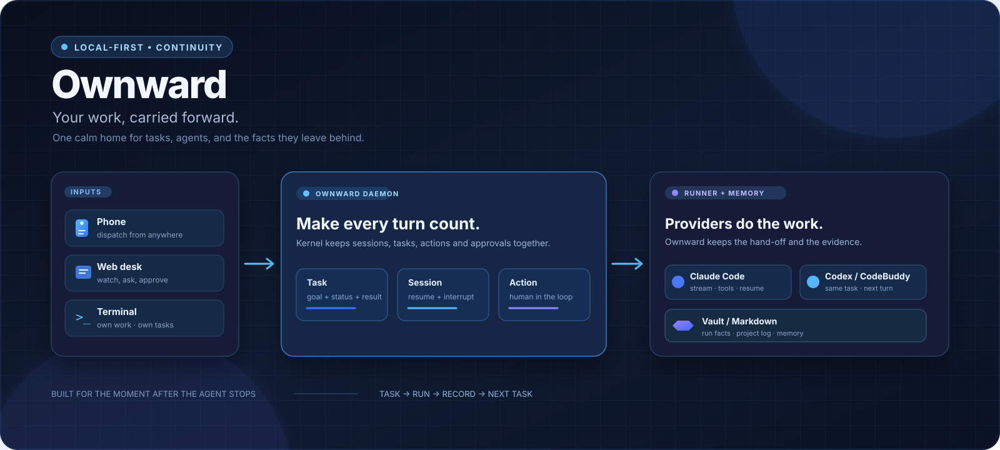
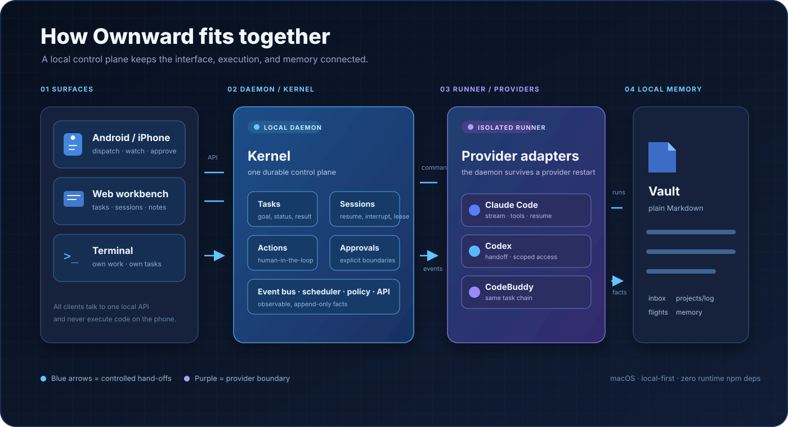
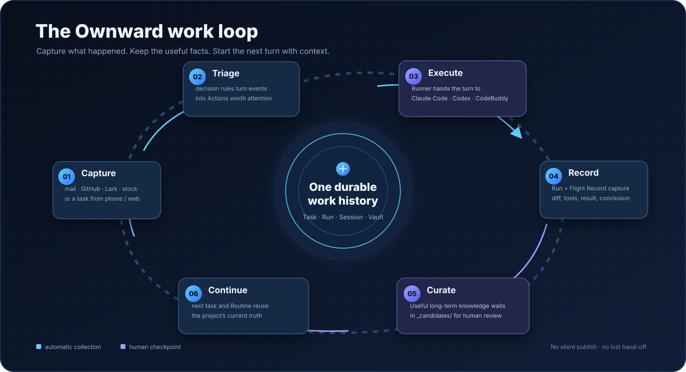
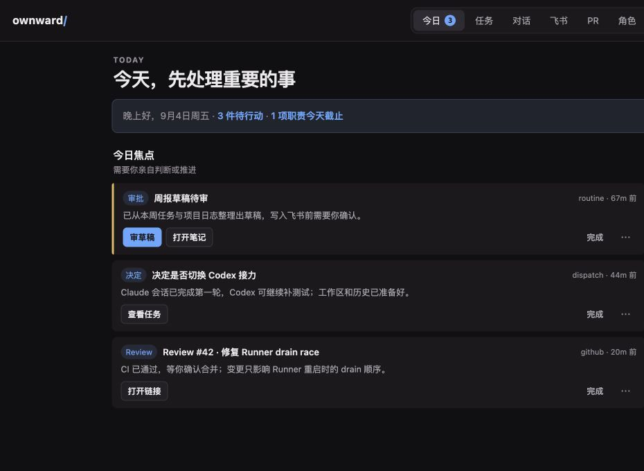

# Ownward

> Your work, carried forward.



Ownward 是一个运行在 **macOS** 上的本地 AI 工作台：你可以从 Web、手机或 Terminal 派发任务，让 Claude Code、Codex 或 CodeBuddy 执行；任务过程、代码变化和结论会被整理回同一个项目的 Markdown 记忆里。

它解决的不是“再做一个聊天框”，而是 AI 编程最容易断掉的那一段：**人离开电脑后，任务仍能继续；Agent 换了，上下文不必重讲；下一次开发能找到上一次留下的事实。**

> **当前状态**：持续迭代中。服务端只支持 macOS；手机端是远程控制面，代码、凭据和 Agent CLI 始终留在你的 Mac 上。

## 先看懂：它是什么，不是什么

| Ownward 是 | Ownward 不是 |
| --- | --- |
| 一个本地常驻后台服务（daemon）+ 独立执行进程（Runner） | IDE 或编辑器替代品 |
| Claude Code / Codex / CodeBuddy 的统一任务控制面 | Agent 的安全沙箱 |
| 可从手机查看、追问、审批和接力的工作台 | 云端代码执行服务 |
| 把 Run、diff、commit、结论写回项目的记录层 | Claude、Codex 或 CodeBuddy 的代理/加速器 |

手机只负责“派任务、看进度、做判断”。真正执行命令的 Agent 仍然在你的 Mac 上，并继承当前用户权限；后台 `worktree` 能隔离 Git 工作目录，但**不是权限边界**。

## 90 秒看懂工作流



可以把一次开发理解成六步：

1. **输入**：从手机、Web 或 Terminal 写下任务，或让 GitHub / 飞书 / Gmail 等事件源进入通知流。
2. **分流**：规则把“值得你处理的事”变成行动卡；普通噪声只留在日志里。
3. **执行**：Runner 把任务交给 Claude Code、Codex 或 CodeBuddy。需要时可把同一任务接力给另一个引擎。
4. **记录**：每轮执行都有 Run；任务结束后生成 Flight Record，包含目标、工具调用摘要、diff、测试和结论。
5. **确认**：可复用的长期知识先进入 `_candidates/`，由人确认后才成为项目当前真相；Routine 草稿写入外部文档也有同一道人审门。
6. **继续**：下一次派任务或生成周报时，直接复用项目记忆，而不是翻旧聊天。



### 两种“继续”不要混淆

- **任务会话**：有真实工作目录、权限和任务状态；可以追问、审批、中断，也可以在 Claude Code / Codex / CodeBuddy 之间接力。
- **普通 Chat**：只重放聊天历史，不携带任务工作区；适合讨论和咨询，不适合让 Agent 直接改代码。

### 把术语翻译成人话

| 术语 | 白话 |
| --- | --- |
| Task | 你交给 Agent 的一件事 |
| Session | 和某个 Agent 持续对话的上下文 |
| Run | Session 里的一轮执行 |
| Action | 今日页上需要你确认、回复或决定的卡片 |
| Flight Record | 任务完成后的可审计记录：目标、diff、测试、结论 |
| Routine | 按时间生成、等你审核的固定交付草稿 |
| Provider | Claude Code、Codex、CodeBuddy 这类执行引擎 |
| worktree | 隔离的 Git 工作目录，不是安全沙箱 |

## 3 分钟跑起来

### 1. 准备环境

- macOS
- [Bun](https://bun.sh)
- Git（Xcode Command Line Tools 自带）
- 至少登录一个 Agent CLI： [Claude Code](https://claude.com/claude-code)、[Codex CLI](https://github.com/openai/codex)，或可选的腾讯 [CodeBuddy](https://copilot.tencent.com)

安装脚本找不到 Claude / Codex 时仍会启动 daemon，但分流、心跳等需要 AI 的功能会不可用；之后补装 CLI 并重新运行 `bash install.sh` 即可。

### 2. 安装并打开工作台

```bash
git clone https://github.com/whtis/ownward.git
cd ownward
./install.sh
open http://127.0.0.1:4517
```

首次安装会询问两项本机配置：称呼（可留空）和 vault 目录（默认 `~/Documents/ownward-vault`）。脚本会生成不会进 Git 的 `config.json`，安装 `own` CLI，并以 launchd 事务启动 daemon 与独立 Runner。

安装事务会做构建、健康检查和 Provider canary，首次运行可能需要几分钟；这是在切换常驻服务前确认新版本可回滚，不是卡死。

打开「设置 → AI 引擎」：

1. 确认已登录的 Provider 已启用；只用 CodeBuddy 也可以跑完整任务链路，但 CodeBuddy 自己仍需要登录和网络。
2. 在「派发默认值」里选一个项目目录、Provider、模型和权限。
3. 点右上角「派新任务」，输入一个小任务，例如“给登录页补一个失败用例”，勾选「后台运行」后派发。

成功时你会在「任务」页看到实时输出，在「今日」页看到需要你处理的行动卡；任务结束后可查看 diff、测试和 Flight Record。

### 3. 不想点页面？直接用 CLI

```bash
# 前台打开 Terminal，适合需要随时接管的工作
bin/own work ~/workspace/example "修复登录页闪退"

# 后台在隔离 worktree 执行，适合让 Agent 自己跑测试
bin/own work ~/workspace/example "补全单元测试" --bg
bin/own work ~/workspace/example "重构 utils 目录" --bg --codex

bin/own status       # daemon 与队列状态
bin/own tasks        # 任务列表
bin/own logs         # daemon 日志
bin/own done <id>    # 收割一个已结束的 terminal 任务
```



<sub>上图由隔离的测试 daemon（4519）和 mock actions/routines 生成，仅用于展示布局，不包含生产数据。</sub>

## 核心用法

### 派发、旁观、接管

任务页会把“正在运行的任务”和“最近的 Agent 会话”放在一起：你可以追问、展开工具调用、审批高风险操作、追加可写目录、查看仓库状态、diff、测试和 commit。任务结束后不必重新打开原 CLI，直接在工作台收尾。

### 跨引擎接力

Claude 限流、需要另一种能力，或只是想让 Codex 再做一次 review 时，可以把任务接给另一个 Provider。Ownward 会保留旧会话和执行记录，只给新引擎注入有界的近期历史，并要求它先检查当前 Git / 文件状态，避免重放已经发生过的工具调用。

接力之后旧会话并没有丢：会话页的「会话谱系与恢复命令」列出链上每个引擎的原生会话 ID 和一条可直接粘贴到终端的恢复命令（`claude --resume …` / `codex resume …` / `codebuddy --resume …`），被 `/new` 换掉的旧会话也在里面。

同一引擎内只换模型或思考深度**不走接力**：会话配置弹窗或输入框里的 `/model opus`、`/effort high` 会就地改参数，下一轮仍续接同一个原生会话（Claude Code 的 `--resume`、Codex 的 `exec resume` 都接受新参数），原生上下文一字不丢。

```text
Claude Code ──限流/换能力──→ Codex ──继续同一工作区──→ CodeBuddy
      └────────────── 旧会话、Run 与 Flight Record 仍可回看 ──────────────┘
```

### 自动收割与项目记忆

Claude Code、Codex CLI 的外部实质会话会被自动发现并收割；CodeBuddy 的私有 transcript 不能从外部回读，因此只收录由 Ownward 发起的 CodeBuddy 任务。

默认 vault 是普通 Markdown，可用 Git、Obsidian 或任意编辑器打开：

```text
~/Documents/ownward-vault/
├── ownward/             # Ownward 自己的每日流水
├── inbox/               # 会话收割的近期素材
├── projects/<slug>/     # 项目 README、演进日志与当前真相
├── flights/             # 每次任务的可审计执行记录
├── memory/              # people / preferences / commitments / goals
│   └── _candidates/     # 模型提出、等待人确认的长期知识
└── daily/               # 自动日报
```

### Routine：让固定职责先有草稿

晨会、周报、项目同步等固定交付可以配置为 Routine。到时间前，Ownward 从近期工作素材生成草稿；你审阅后，才会派任务写入飞书文档。默认关闭，可从 [examples/routines.json](examples/routines.json) 复制样例到 `data/routines.json`。

## 数据在哪里，谁能看到

| 数据 | 默认位置 / 去向 | 需要知道的事 |
| --- | --- | --- |
| 配置、任务、日志、行动卡 | Mac 本地 `data/` | `config.json`、`data/`、凭据和 vault 不要提交到 Git |
| 项目记忆 | 你选择的 Markdown vault | 可以自己搜索、编辑、提交和备份 |
| Agent 输入与工具调用 | 发送给所选 Provider | 受 Claude / OpenAI / 腾讯各自服务条款约束 |
| 手机访问 | 默认只监听 `127.0.0.1:4517` | 远程访问必须加 TLS / Tailscale 和 Ownward token |

安全边界请先记住这四点：

- 默认只允许本机访问；`dashboard.listen=all` 会绑定 `0.0.0.0`，不是“天然只限局域网”。
- Agent 继承当前用户能访问的文件和命令权限；`safe` 审批模式更适合日常，`bypass` 只在你明确承担风险时开启。
- 后台 worktree 只隔离 Git checkout，不能防止 Agent 访问它被授权的其他目录。
- Ownward 保留三道人审门：高风险操作审批、Routine 文档写入、长期记忆候选晋升。

完整安全说明见 [SECURITY.md](SECURITY.md)。需要手机远程接入时，先看 [远程访问指南](docs/remote-access.md)。

## 支持矩阵

| 能力 | Claude Code | Codex | CodeBuddy |
| --- | :---: | :---: | :---: |
| Ownward 内派发、续聊、旁观和收尾 | ✓ | ✓ | ✓ |
| 任务会话跨引擎接力 | ✓ | ✓ | ✓ |
| 普通 Chat 跨引擎继续 | ✓ | ✓ | 按配置开放 |
| 统一 Run / Flight Record | ✓ | ✓ | ✓ |
| 自动收割外部 CLI 会话 | ✓ | ✓ | — |

客户端与可选事件源：

- **Web 工作台**：随 daemon 提供，默认 `http://127.0.0.1:4517`。
- **Android**：从 [GitHub Releases](https://github.com/whtis/ownward/releases) 获取；代码不会复制到手机执行。
- **iPhone**：要求 iOS 26+，可用 Xcode 装到真机；TestFlight 渠道由发布者提供，构建说明见 [ios/README.md](ios/README.md)。
- **飞书 / GitHub / Gmail / 股票**：默认关闭，配置入口与凭据说明见 [AGENTS.md](AGENTS.md)。

## CLI 速查与最小排错

| 现象 | 先做什么 |
| --- | --- |
| 浏览器打不开 4517 | `bin/own status`，再看 `bin/own logs`；确认端口未被其他进程占用 |
| `own` 找不到 | 把 `~/.local/bin` 加入 `PATH`，或直接使用 `bin/own` |
| Provider 显示未启用 | 在「设置 → AI 引擎」启用并确认 CLI 已登录，然后重跑 `bash install.sh` |
| 后台任务不动 | 看 Runner 状态和 `bin/own logs`；不要手动重放未知结果的任务 |
| 手机连不上 | 不要直接把 4517 暴露公网；按 [远程访问指南](docs/remote-access.md) 配 TLS / Tailscale / token |

## 可选集成

Ownward 的核心任务链路不依赖外部账号。需要时再开启：

- 飞书：消息、日历、Routine 文档写入与 DM 通知；
- GitHub：通知、PR 工作台和 review 请求；
- Gmail：邮件分流与行动卡；
- 股票：按 watchlist 和检查时刻做定点行情检查；
- Strategy：在这些基础上增加论点卡、仓位规则和止损监控，默认关闭。

每个事件源都需要在设置页开启并准备对应 CLI / 凭据；终端配置写 `connectors.<name>.enabled`（旧版本也兼容 `sources.*`），详细说明见 [AGENTS.md](AGENTS.md)。

## 开发 Ownward

Ownward 是 Bun / TypeScript daemon + 无构建步骤的静态 Web，运行时零 npm 依赖。Provider 任务由独立 Runner 执行，daemon 重启时会先安全 drain。

```bash
bun install --frozen-lockfile
./verify.sh
```

验证门包含构建、TypeScript 类型检查、单元测试、daemon 冒烟、API 探活和 Web JavaScript 解析。修改自身代码前请先读 [SELF.md](SELF.md)，贡献流程见 [CONTRIBUTING.md](CONTRIBUTING.md)，完整架构见 [docs/architecture-v1.md](docs/architecture-v1.md)。

### Vertical 扩展（高级）

Ownward 的研发工作台是内置 `dev` Vertical。Kernel、Runner、Provider、Action、调度和 storage 是可复用底座；外部 Vertical 可以声明自己的路由、页面和领域数据，并通过独立 Host 获得崩溃隔离与开发时热重载。它必须是用户明确启用的 trusted 本地代码，独立进程不是恶意代码沙箱。

想做扩展，从 [只读 Desk 示例](examples/verticals/desk-readonly) 和 [扩展契约](docs/contributing/extension-contract.md) 开始。

## 文档地图

- **第一次使用**：本 README → [3 分钟上手](#3-分钟跑起来) → [SECURITY.md](SECURITY.md)
- **配置与接入**： [AGENTS.md](AGENTS.md)
- **远程手机访问**： [docs/remote-access.md](docs/remote-access.md)
- **贡献代码**： [CONTRIBUTING.md](CONTRIBUTING.md) → [docs/architecture-v1.md](docs/architecture-v1.md)
- **开发 Vertical**： [SELF.md](SELF.md) → [docs/contributing/extension-contract.md](docs/contributing/extension-contract.md)
- **安全边界**： [SECURITY.md](SECURITY.md)
- **版本与路线**： [CHANGELOG.md](CHANGELOG.md) · [ROADMAP.md](ROADMAP.md)

## License

[Apache License 2.0](LICENSE)
